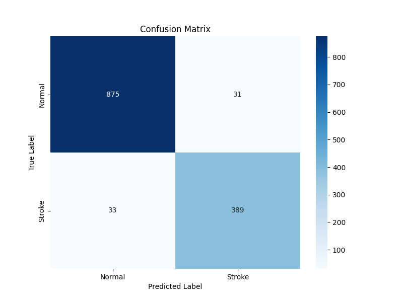
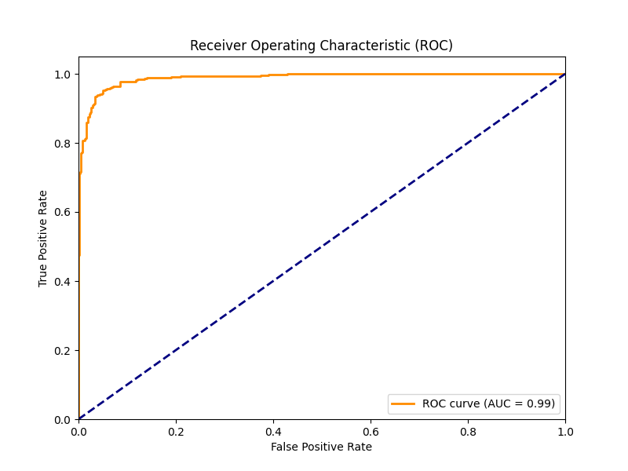
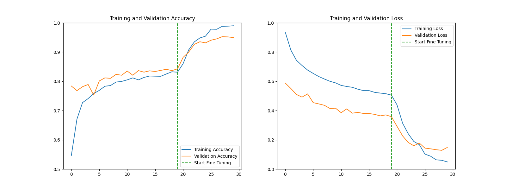

# Deep Learning Based Brain Stroke Detection from CT Images

This project implements a deep learning solution to detect brain strokes from CT images using Transfer Learning with the VGG16 architecture. The model achieves a validation accuracy of approximately 95% and demonstrates high sensitivity in identifying stroke cases.

## Performance and Results

The model performance was evaluated using a comprehensive validation set. Below are the key visualizations and analysis of the results.

### 1. Confusion Matrix
The confusion matrix illustrates the classification performance on the test data.



**Analysis:**
The model shows a strong ability to distinguish between "Stroke" and "Normal" classes.
- **True Positives:** 389 stroke cases were correctly identified.
- **False Negatives:** Only 33 stroke cases were missed. In medical diagnostics, minimizing false negatives is critical to ensure patients receive necessary treatment.
- **Precision:** The model has a low false positive rate, misclassifying only 31 normal images as strokes.

### 2. ROC Curve
The Receiver Operating Characteristic (ROC) curve depicts the diagnostic ability of the binary classifier.



**Analysis:**
- **AUC Score:** An Area Under the Curve (AUC) score of **0.99** indicates exceptional classification performance.
- The curve's proximity to the top-left corner demonstrates that the model maintains a high True Positive Rate while keeping the False Positive Rate very low across different threshold settings.

### 3. Training History
The plots below track the Accuracy and Loss metrics throughout the training process, including the initial training and fine-tuning phases.



**Analysis:**
- **Fine-Tuning Effect:** The vertical dashed line marks the start of the Fine-Tuning phase. As observed, unfreezing the upper layers of VGG16 and training with a lower learning rate resulted in a significant improvement in validation accuracy (jumping from ~84% to ~95%).
- **Generalization:** The validation loss decreases consistently alongside training loss, indicating that the model is learning effective features without overfitting to the training data.

---

## Methodology

This project utilizes a Transfer Learning approach:
1.  **Preprocessing:**
    * **Brain Windowing:** Applied specific window settings (Center=40, Width=80) to CT images to highlight brain tissue and potential lesions.
    * **Normalization:** Images were normalized to the [0, 1] range.
2.  **Model Architecture:**
    * **Base:** VGG16 pre-trained on ImageNet (weights frozen initially).
    * **Custom Head:** GlobalAveragePooling2D, followed by a Dense layer (256 units, ReLU), Dropout (0.5), and a final Sigmoid output layer.
3.  **Training Strategy:**
    * **Phase 1:** Training only the custom head for 20 epochs.
    * **Phase 2 (Fine-Tuning):** Unfreezing the top convolutional block (Block 5) of VGG16 and re-training with a reduced learning rate (1e-5) to adapt the model specifically to CT stroke features.

## Project Structure

- **Brain_Stroke_Detection.ipynb:** The main Jupyter Notebook containing data loading, preprocessing, model training, and evaluation code.
- **best_stroke_model.keras:** The trained model weights achieving the highest validation accuracy.
- **requirements.txt:** List of Python dependencies required to run the project.
- **results/:** Directory containing the evaluation plots (Confusion Matrix, ROC Curve, Training History).

## How to Run

1.  **Clone the repository:**
    ```bash
    git clone [https://github.com/YOUR_USERNAME/YOUR_REPOSITORY_NAME.git](https://github.com/YOUR_USERNAME/YOUR_REPOSITORY_NAME.git)
    cd YOUR_REPOSITORY_NAME
    ```

2.  **Install dependencies:**
    ```bash
    pip install -r requirements.txt
    ```

3.  **Run the Notebook:**
    Open `Brain_Stroke_Detection.ipynb` in Jupyter Lab, VS Code, or Google Colab. Ensure the dataset path is correctly configured in the notebook before running the cells.

## Contact

Developed by **Ahmet Enes Maden**.
